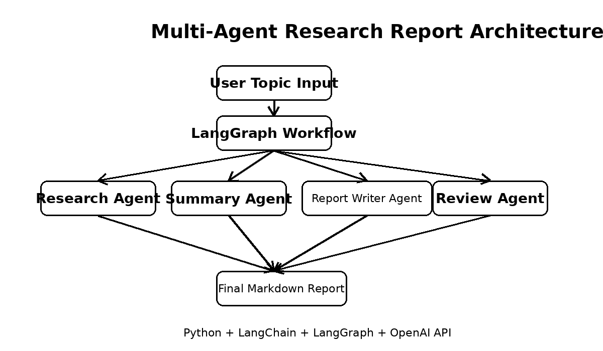
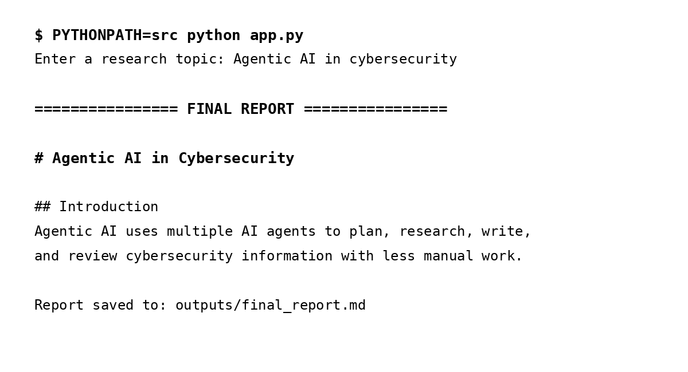

# Multi-Agent Research Report Generator


## Short Description

Multi-Agent Research Report Generator is an AI workflow that researches a user topic, summarizes the findings, writes a structured report, and reviews the final output.

It solves the problem of turning a broad topic into a clear report by separating the task across specialized AI agents.

## Features

✅ Topic-based research workflow  
✅ Multi-agent task separation  
✅ Research summarization  
✅ Structured report generation  
✅ Final report review and improvement  
✅ Markdown report export  
✅ Simple CLI interface  
✅ GitHub-friendly project structure  
✅ Basic unit test and GitHub Actions workflow  

## Architecture Diagram



```text
User Topic
   ↓
Python CLI
   ↓
LangGraph Workflow
   ↓
Research Agent
   ↓
Summary Agent
   ↓
Report Writer Agent
   ↓
Review Agent
   ↓
Final Markdown Report
```

## Tech Stack

- Python
- LangGraph
- LangChain
- OpenAI API
- python-dotenv
- pytest
- GitHub Actions
- Markdown

## Skills Demonstrated ⭐

- Python
- Software Engineering
- AI Agents
- Multi-Agent Workflows
- LangGraph
- LangChain
- OpenAI API
- Prompt Engineering
- Report Generation
- Workflow Orchestration
- LLM Application Development
- Unit Testing
- GitHub Actions
- CLI Development
- Backend Project Structure
- Documentation

## Project Structure

```text
multi-agent-research-report/
│
├── app.py
├── main.py
├── requirements.txt
├── pyproject.toml
├── README.md
├── LICENSE
├── .gitignore
├── .env.example
│
├── docs/
│   ├── architecture.png
│   ├── demo.md
│   ├── evaluation.md
│   └── screenshots/
│       └── terminal-output.png
│
├── src/
│   └── multi_agent_report/
│       ├── __init__.py
│       ├── agents.py
│       ├── config.py
│       ├── workflow.py
│       └── utils.py
│
├── tests/
│   └── test_utils.py
│
└── .github/
    └── workflows/
        └── tests.yml
```

## Installation

### 1. Clone the repository

```bash
git clone https://github.com/ParisaArbab/multi-agent-research-report.git
cd multi-agent-research-report
```

### 2. Create a virtual environment

```bash
python -m venv .venv
```

For macOS or Linux:

```bash
source .venv/bin/activate
```

For Windows:

```bash
.venv\Scripts\activate
```

### 3. Install dependencies

```bash
pip install -r requirements.txt
```

### 4. Add your OpenAI API key

```bash
cp .env.example .env
```

Then edit `.env`:

```env
OPENAI_API_KEY=your_openai_api_key_here
```

### 5. Run the project

For macOS or Linux:

```bash
PYTHONPATH=src python app.py
```

For Windows PowerShell:

```powershell
$env:PYTHONPATH="src"; python app.py
```

## Usage

Enter any research topic when the program asks for input.

Example:

```text
Enter a research topic: Agentic AI in cybersecurity
```

The project prints the final report in the terminal and saves it here:

```text
outputs/final_report.md
```

## Screenshot



## Example Output

```text
Issue:
A broad research topic can be hard to organize into a clear report.

Recommendation:
Use separate AI agents for research, summarization, report writing, and review.

Generated Output:
A structured Markdown report with introduction, main discussion, benefits, challenges, applications, and conclusion.

Confidence:
High, because each agent has one clear responsibility.
```

## How It Works

The user enters a topic. The LangGraph workflow sends the topic to the Research Agent. The research result goes to the Summary Agent. The summary and research go to the Report Writer Agent. The draft report then goes to the Review Agent, which improves clarity, grammar, and structure. The final report is saved as a Markdown file.

```text
Topic
↓
Research Agent
↓
Summary Agent
↓
Report Writer Agent
↓
Review Agent
↓
Markdown Report
```

## Evaluation / Results

| Evaluation Area | Current Result |
|---|---|
| Report structure | Includes title, introduction, discussion, benefits, challenges, applications, and conclusion |
| Output format | Saves final report as Markdown |
| Workflow quality | Uses clear multi-agent separation |
| Test coverage | Includes a basic unit test for report saving |
| Human evaluation | Can be scored for clarity, usefulness, and completeness |
| LLM evaluation | Can be added to score the final report automatically |

More details are available in [`docs/evaluation.md`](docs/evaluation.md).

## Challenges

- LLMs can hallucinate information.
- Long topics may exceed token limits.
- The current version does not include live web search.
- The report quality depends on prompt design.
- Source citation support can be improved.

## Future Improvements

- Add real web search with citations.
- Add FastAPI endpoints.
- Add Streamlit or React UI.
- Add PDF export.
- Add human approval before final report generation.
- Add memory for previous research topics.
- Add streaming output.
- Add Docker support.
- Add stronger automated evaluation.

## Tests

Run tests with:

```bash
pytest
```

This project also includes a GitHub Actions workflow:

```text
.github/workflows/tests.yml
```

## Demo

A 30 second demo can show:

1. Running the project from the terminal
2. Entering a topic
3. Viewing the generated report
4. Opening `outputs/final_report.md`

Demo notes are available in [`docs/demo.md`](docs/demo.md).

## Project Status

Under Active Development

## License

This project is for educational and portfolio purposes. All rights reserved by the author.

## Author

**Parisa Arbab**

GitHub: https://github.com/ParisaArbab  
LinkedIn: https://www.linkedin.com/in/parisa-arbab
